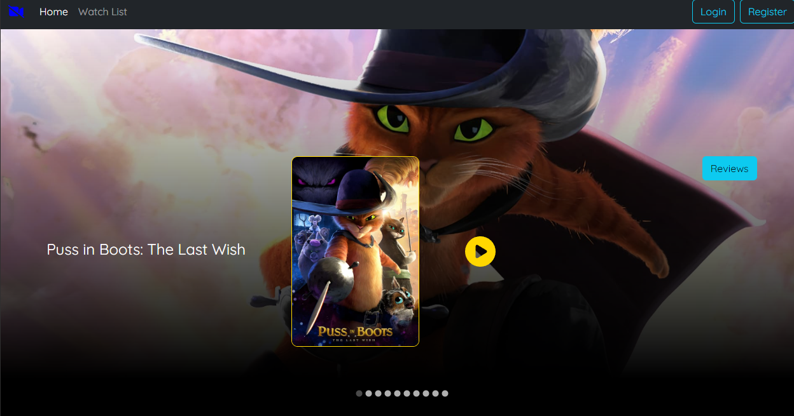
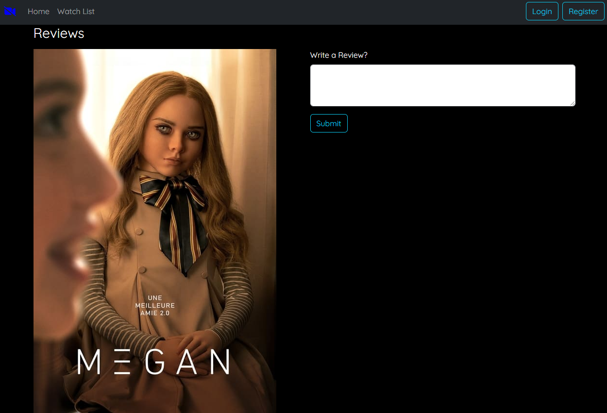
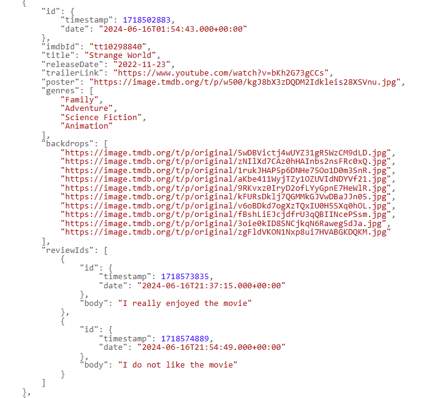

# Mini_IMDB

# Project Title
**Mini_IMDB** is a dynamic web application designed to enhance the movie-watching experience by providing users with an immersive preview of movie trailers alongside comprehensive reviews for each film. This platform serves as a centralized hub where movie enthusiasts can explore and discover films through vivid trailers, making informed viewing decisions based on detailed critiques and user-generated reviews.

## Description

This project is a full-stack application using React for the frontend, Spring Boot as the backend framework, and MongoDB for persistent storage. It is designed to demonstrate a CRUD application integrating the three technologies.

## Demo
<div style="text-align: center; display: flex; align-items: center; justify-content: center;">
  <div style="width: 40%; height: auto; display: flex; justify-content: center; align-items: center;">
    
  </div>
  <div style="width: 40%; height: auto; display: flex; justify-content: center; align-items: center;">
    
  </div>
</div>

<div style="text-align: center;">

</div>

## Prerequisites

Before you begin, ensure you have met the following requirements:
- Java 21 or newer
- Node.js 20.x or newer
- MongoDB 4.x or newer

## Technologies Used

- **Frontend**: React
- **Backend**: Spring Boot
- **Database**: MongoDB

## Setup and Installation

### Backend Setup

1. **Clone the repository**:
    ```bash
    https://github.com/xiuyiqian/Mini_IMDB.git
    cd <clone_dir>
    ```

2. **Navigate to the backend directory**:
    ```bash
    cd spring_project_2
    ```

3. **Build the project** (Make sure you have Maven installed):
    ```bash
    mvn clean install
    ```

4. **Run the Spring Boot application**:
    ```bash
    mvn spring-boot:run
    ```

### Frontend Setup

1. **Navigate to the frontend directory from the project root**:
    ```bash
    cd ./MovieClient/imdb-mini
    ```

2. **Install dependencies**:
    ```bash
    npm install
    ```

3. **Start the React application**:
    ```bash
    npm start
    ```

### Database Setup

Ensure MongoDB is running on your system. You can start MongoDB with the following command on most systems:
```bash
mongod
```

## Backend TESTING and RUNNING
   **API Endpoints**: Detailed information about each endpoint including:
   - **URL**: [The endpoint URL](http://localhost:8080/api/v1).
   - **Method**: HTTP method used (GET, POST, etc.).
   - **Description**: the endpoints is for fetch and post data onto the MONGODB Database
   - **Sample Request**: 
   ```bash
   curl -X GET http://localhost:8080/api/v1/movies
   ```
